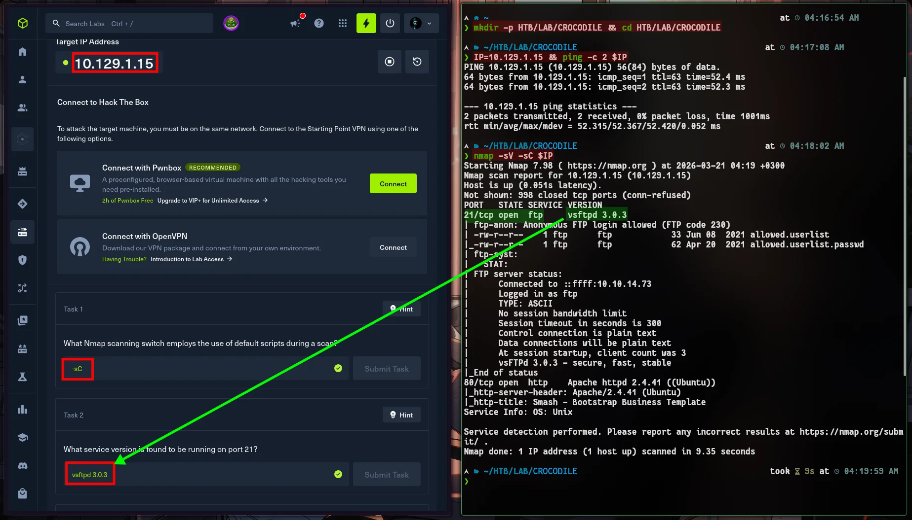
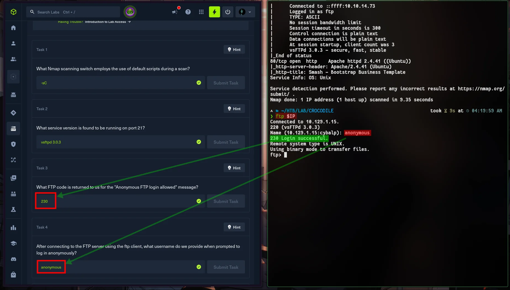
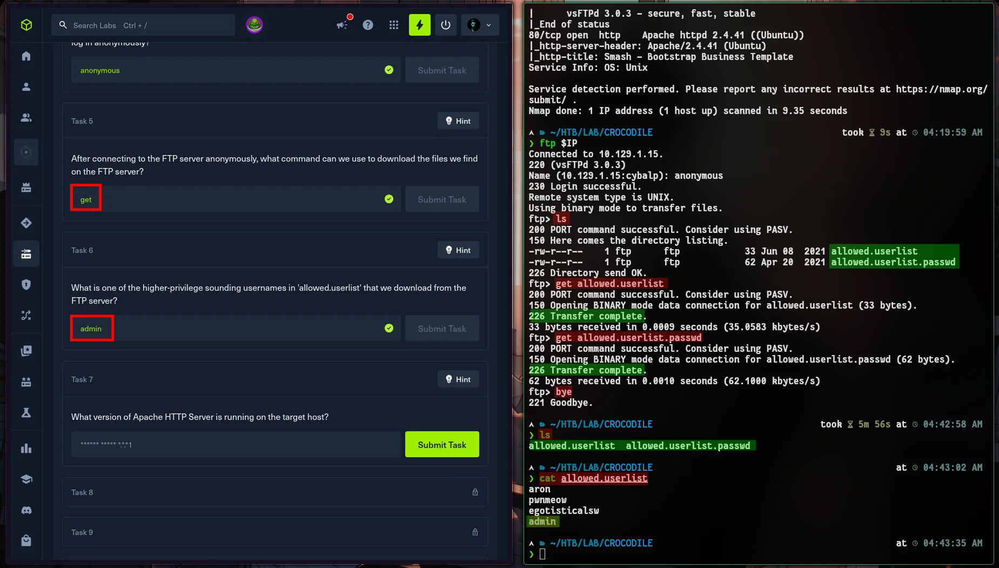
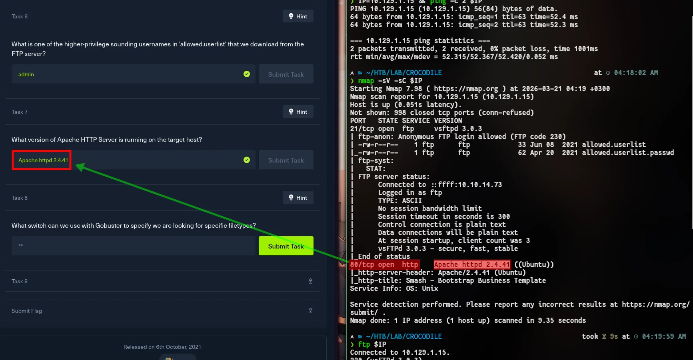
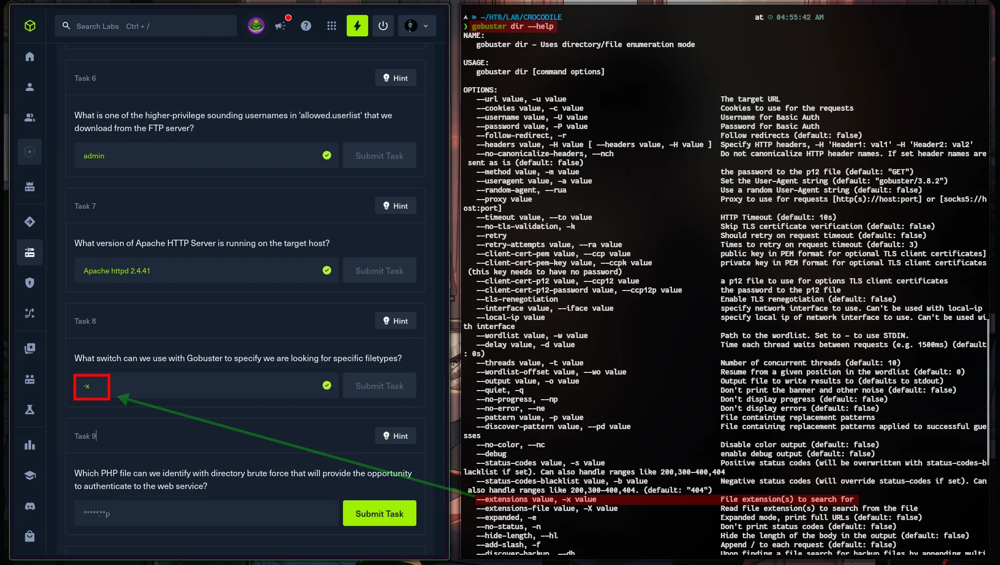
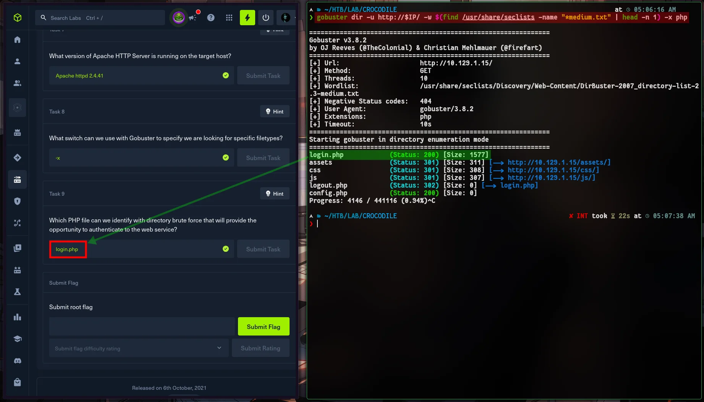
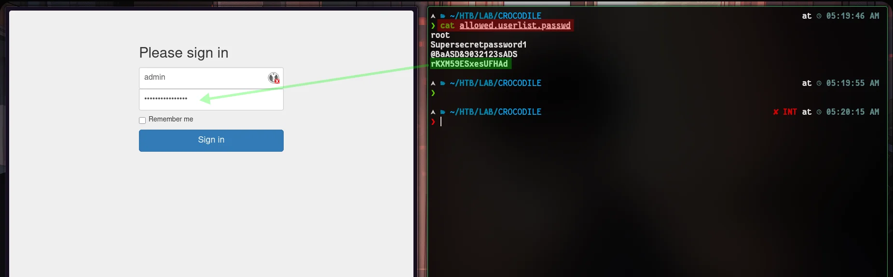

:::caution[Machine Information]
- **Platform:** HTB
- **Lab:** Starting Point
- **OS:** Linux
- **Difficulty:** Very Easy
- **IP:** `10.129.1.15` (your assigned IP)
:::

---

# Step 0: Getting Started

I think we’ve now got a good grasp of the ‘introduction’ section, which we’ve come to regard as standard. If you have any questions on this, please take a look at these machines.

- [Meow](https://www.cybalp.me/ctf/writeups/htb-meow/)
- [Fawn](https://www.cybalp.me/ctf/writeups/htb-fawn/)
- [Dancing](https://www.cybalp.me/ctf/writeups/htb-dancing/)
- [Redeemer](https://www.cybalp.me/ctf/writeups/htb-redeemer/)
- [Appointment](https://www.cybalp.me/ctf/writeups/htb-appointment/)
- [Sequel](https://www.cybalp.me/ctf/writeups/htb-sequel/)

---

# Step 1: Recon



```bash
nmap -sC -sV $IP
```

We’ve set up the environment, our VPN connection is working, we’ve assigned our variable and run our nmap scan. 

- Open port: 21/FTP
- Version: vsftpd 3.0.3

---

# Step 2: FTP — anonymous login & file grab

**vsftpd** here allows **`anonymous`** logins



```bash
ftp $IP
```

At the `Name` prompt: **`anonymous`**  
At the password prompt: press **Enter** (or anything — it’s ignored).



By following the command sequence below, we use the `get` command to download the files we need from FTP to our own host.

```ftp
ls
get allowed.userlist
get allowed.userlist.passwd
bye
```

This allows us to exit FTP and read the contents of the files.

```bash
ls
cat allowed.userlist
```

Open the files locally — you’ll find a **username list** and a **parallel password list** (the same line order corresponds to credential pairs). Identify the account that appears to be the **admin** or privileged user.

---

# Step 3: Web — discover `login.php`, sign in, flag

For the next step, we need to return to the nmap output. Let’s answer the question.



To find the answer to the other question, which is straightforward for us, I’m searching for the answer using the `gobuster dir --help` command. -x OK!



Brute-force **directories and `.php` files** so you don’t have to guess URLs manually:

Depending on my operating system and seclist structure, the command I need to write is slightly different. In short, I’m performing a search on the files in the `seclist/` directory. This search yields the following result. Adapt Gobuster to your own system.



```bash
gobuster dir -u http://$IP/ -w $(find /usr/share/seclists -name "*medium.txt" | head -n 1) -x php
```

```bash
gobuster dir -u http://$IP/ -w /usr/share/wordlists/dirb/common.txt -x php # alternative
```

Then go to http://[youripaddress]/login.php to solve the puzzle.



```bash
ls
cat allowed.userlist.passwd
```
```
c7110277ac44d78b6a9fff2232434d16
```

# That’s it.
