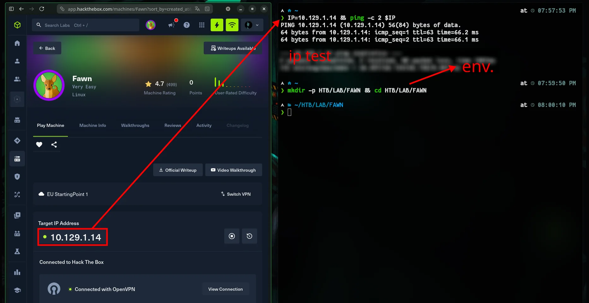
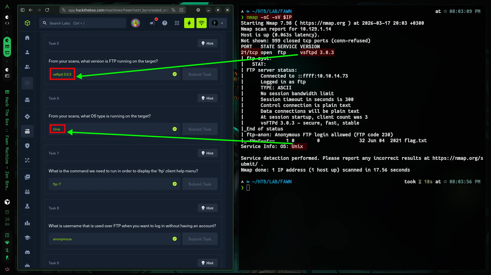
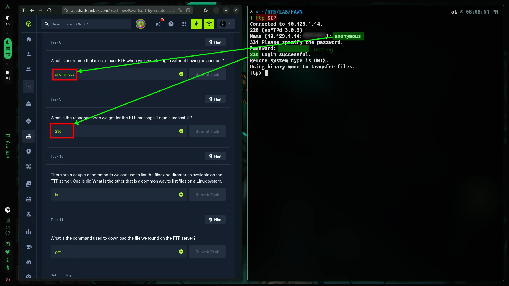
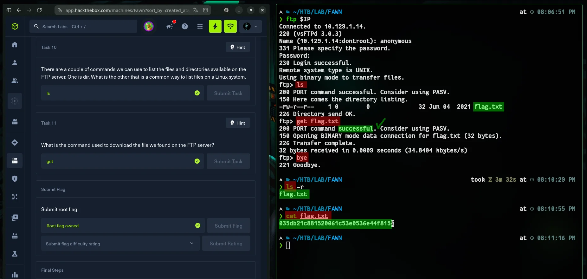
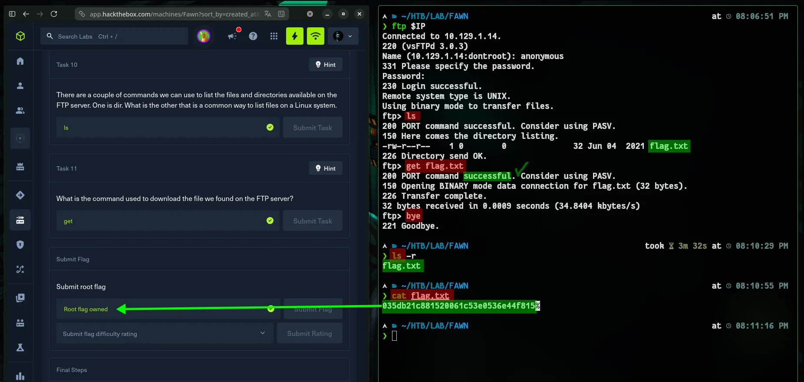

:::caution[Machine Information]
- **Platform:** HTB
- **Lab:** Starting Point
- **OS:** Linux
- **Difficulty:** Very Easy
- **IP:** `10.129.1.14`
:::

---

# Step 0: Getting Started

If you're not sure how to get started, [this will help.](https://www.cybalp.me/ctf/writeups/htb-meow/#step-0-getting-started)



OK!

---

# Step 1: Recon

```bash
nmap -sC -sV $IP
```



Only **21/tcp (FTP)** is open. vsftpd 3.0.3 — anonymous access should be tested.

---

# Step 2: Solution

## FTP Connected

```bash
ftp $IP
```



## Anonymous Login

| User      | Password |
| :-------- | :------- |
| anonymous | (Enter) |

Press Enter when prompted for a password. -> `230` = successful.

## Flag

```bash
ls
get flag.txt
bye
```



# Flag

```bash
cat flag.txt
```


```
035db21c881520061c53e0536e44f815
```

Yep. OK!
