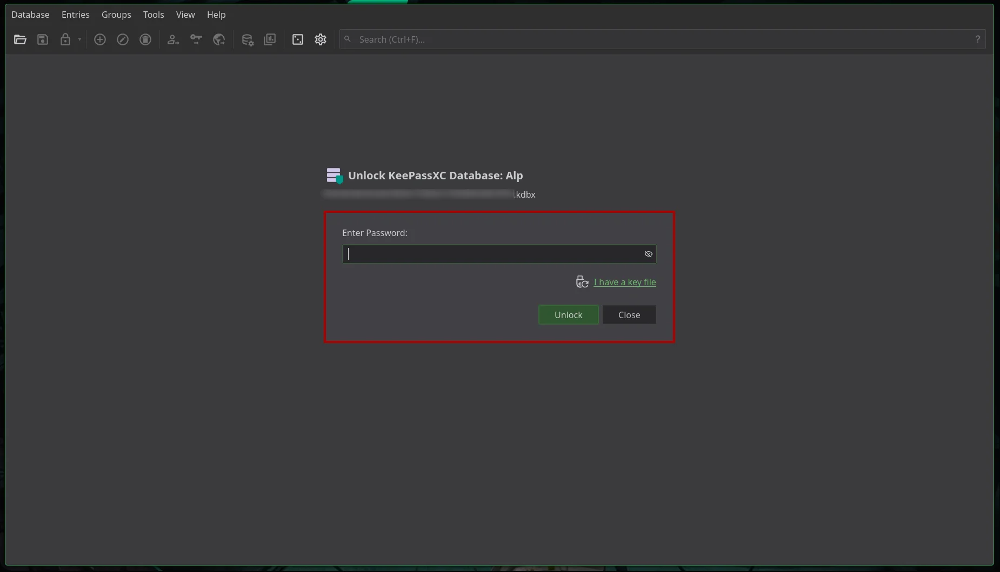

# KeePassXC?

KeePassXC is a **modern, cross-platform password manager** that stores your credentials in an encrypted database file. No cloud sync by default. No ads. No trackers. No subscription. It's the kind of tool that respects a simple principle: :spoiler[**your passwords are yours. Period.**]

| 

 |
| :---: |

## Why open source matters for password managers

A password manager is a **single point of failure** for your digital identity. If it's proprietary, you're trusting a company's word that they don't log, don't backdoor, and don't sell. With KeePassXC, the source code is on GitHub. Security researchers, auditors, and you can inspect it. The French National Cybersecurity Agency (ANSSI) did exactly that and awarded KeePassXC 2.7.9 a **Security Visa** (CSPN certification). That's not marketing — it's third-party validation.

:::important
**Trust, but verify.** Open source lets you verify. Proprietary software only lets you trust.
:::

## Core features

| Feature | Description |
| :--- | :--- |
| **Encrypted database** | AES-256, ChaCha20 — your data stays encrypted at rest |
| **Offline-first** | No mandatory cloud; sync via Dropbox, Nextcloud, or USB if you want |
| **Auto-Type** | Fills usernames and passwords into apps and browsers |
| **Browser integration** | Extensions for Firefox, Chrome, Edge, Vivaldi, Tor Browser |
| **TOTP support** | Store and generate 2FA codes inside the same database |
| **YubiKey** | Challenge-response auth for database unlock |
| **Passkeys** | Modern passwordless auth support |
| **Password generator** | Customizable length, character sets, passphrases |
| **Breach detection** | Have I Been Pwned integration to flag compromised passwords |
| **SSH Agent** | Manage SSH keys through KeePassXC |
| and others.. | Yep, and others... |

## Security model

KeePassXC does not store your master password. It derives an encryption key from it using Argon2 (or similar KDF). The database file is encrypted; without the master password (and optionally a key file or hardware key), the data is unreadable. No server ever sees your passwords. No "zero-knowledge" marketing needed — the architecture is inherently zero-knowledge because there is no server.

:::caution
**Your master password is the only key.** If you lose it, the database cannot be recovered. By design, there is no “Forgot my password” option.
:::

## Getting Started

1. **Download** from [keepassxc.org](https://keepassxc.org/download) or via your distribution’s package manager (`pacman -S keepassxc`, `apt install keepassxc`, etc.)
2. **Create a database** — File → New Database → set a strong master password
3. **Add entries** — or import from CSV, 1Password, Bitwarden, etc.
4. **Optional:** Install the browser extension and enable the “KeePassXC-Browser” option in the application
5. **Optional:** Add a key file or YubiKey for additional authentication factors

# in short.. WHY?

> "we promise we don't look" ahaha NO! NO cloud!. NO ads! Full control! Because this belongs to me!

# GO APP

- [KeePassXC](https://keepassxc.org/) 
- [GitHub](https://github.com/keepassxreboot/keepassxc) 
- [Documentation](https://keepassxc.org/docs/)
