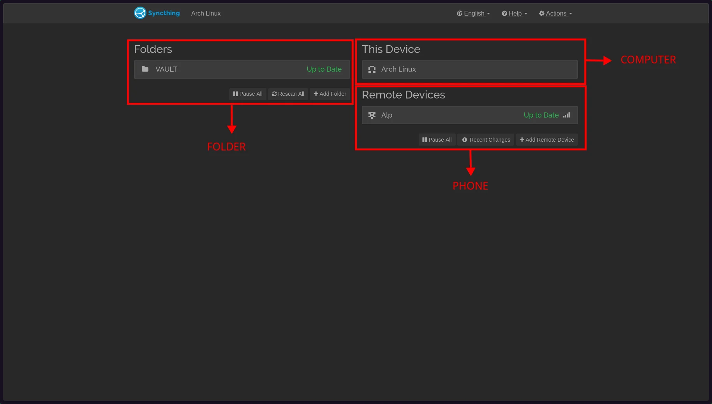

# Syncthing?

Syncthing is an open-source tool that performs **continuous** file synchronization between devices without the need for a **centralized cloud service**. All you need for two devices to find each other and start syncing is for Syncthing to be running on both devices and to decide which folders to sync.

## Core features

| Feature | Description |
| :--- | :--- |
| **Decentralized sync** | Files flow between devices; no reliance on a central “single point of failure” |
| **Continuous updates** | Synchronization is automatically triggered when a file is modified |
| **Secure connections** | Connections are secured with authentication |
| **Conflict handling** | If changes occur simultaneously, they are managed using versioning and conflict resolution principles |
| **Web UI / GUI** | Easy to manage, including a browser interface |
| **Cross-platform** | Runs on Linux, Windows, macOS, and other platforms |

## Security model

In Syncthing, trust is based not so much on a “logged-in account” as on the **device ID** and the confirmation that “does this device belong to me?” When the same device ID is associated on both sides, synchronization proceeds based on that match.

## Getting Started

1. **Install / Start**
   - Install Syncthing from the official website or your distribution’s package manager.
   - When the application opens, you’ll see the web interface (usually `http://localhost:8384`).

2. **Get a Device ID**
   - Copy the `Device ID` value from the first device.

3. **Add the other device**
   - On the second device, use `Add Remote Device` to enter the first device’s `Device ID`.
   - Complete the necessary “approve / trust” steps on both devices.

4. **Create a folder pair**
   - Select the folder you want to pair (Local Folder).
   - Select which device(s) to pair with (Remote Device).

5. **Connection flow / network**
   - If both devices are on the same network, it usually works automatically.
   - If there is NAT/Firewall, you can use port forwarding or (if necessary) relay options.

---

# in short.. WHY?

> I can’t entrust my important personal files to a cloud service!

# GO APP

- [Syncthing](https://syncthing.net/)
- [GitHub](https://github.com/syncthing/syncthing)
- [Documentation](https://docs.syncthing.net/)

