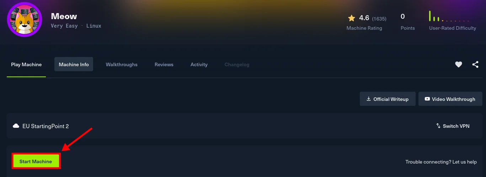
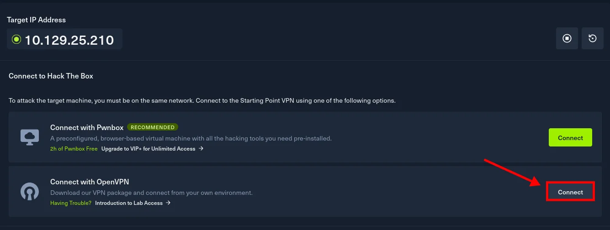
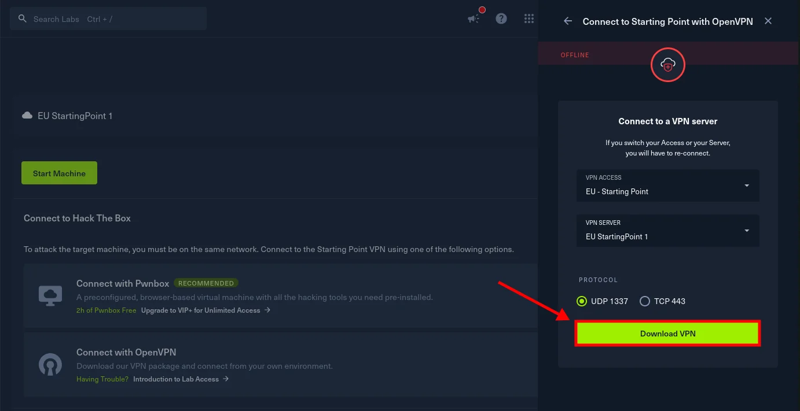
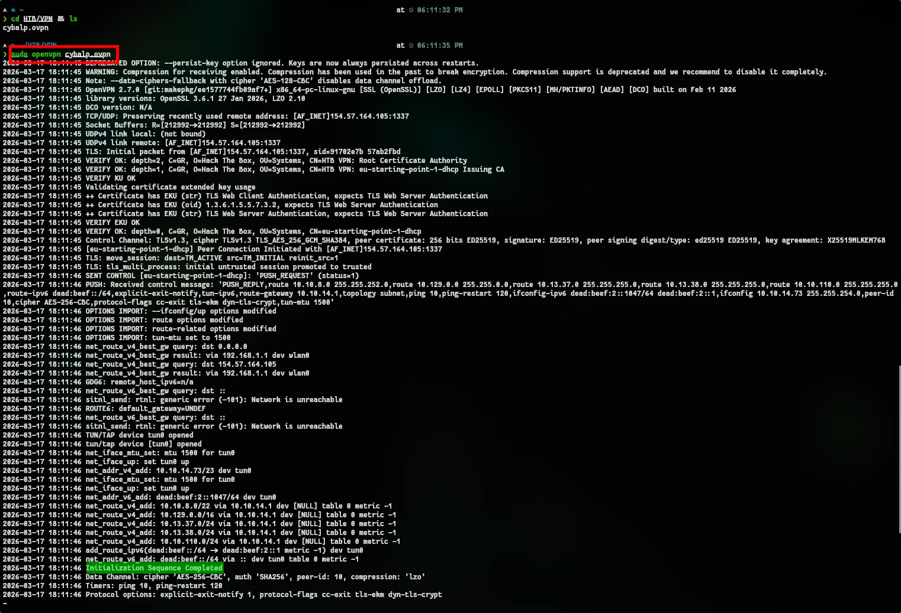
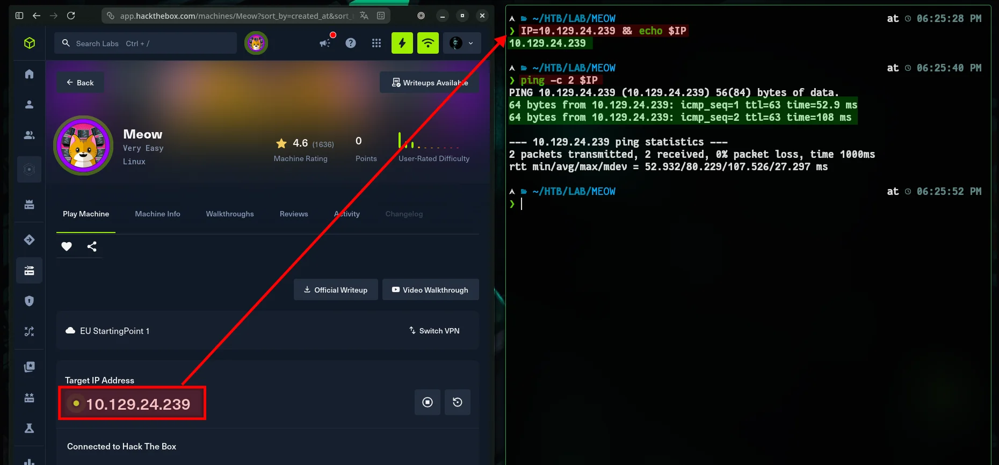
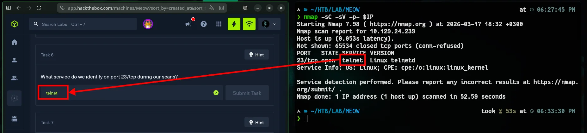
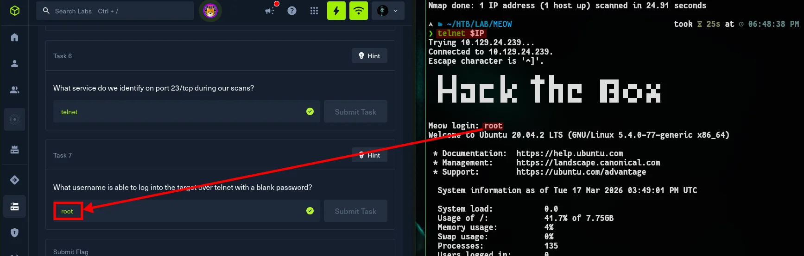
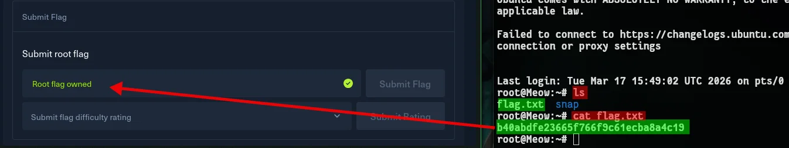

:::caution[Machine Information]
- **Platform:** HTB
- **Lab:** Starting Point
- **OS:** Linux
- **Difficulty:** Very Easy
- **IP:** `10.129.24.239`
:::

---

# Step 0: Getting Started

1. **Start** → Start Machine



2. **VPN** → `.ovpn` download,





2. **VPN Connect** → `sudo openvpn {{filename}}.ovpn`



Don’t close this terminal; open another one and we’ll start the machine.

3. **Target & Test** → Set the $IP variable in the new terminal, and test..



I’m not going to write the answer to every question here. The questions are simple anyway. if you don't know, just Google it!

# Step 1: Recon

By the time you reach question 6, you’ll need to perform a scan. Use the system to scan for open ports.

```bash
nmap -sC -sV -p- $IP
```



---

# Step 2: Solution

##  Telnet Connected

```bash
telnet $IP
```




## and Flag

```bash
ls
cat flag.txt
```


```
b40abdfe23665f766f9c61ecba8a4c19
```
# OK!

Very ver easy. Play smart and keep it simple. Time is of the essence.