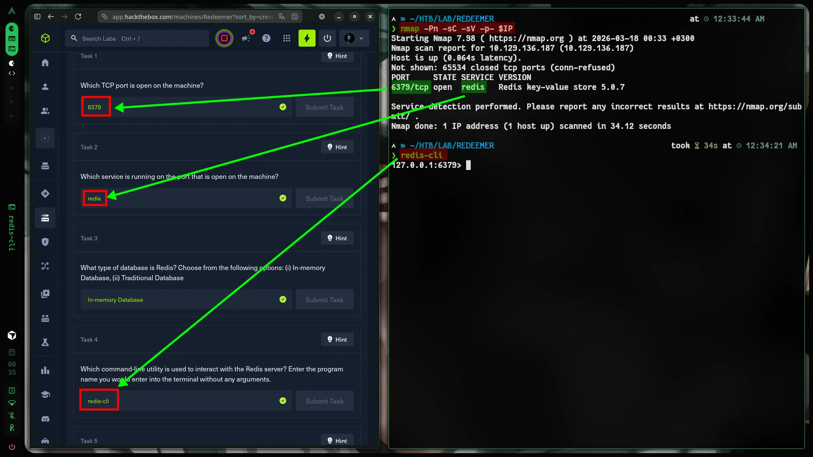
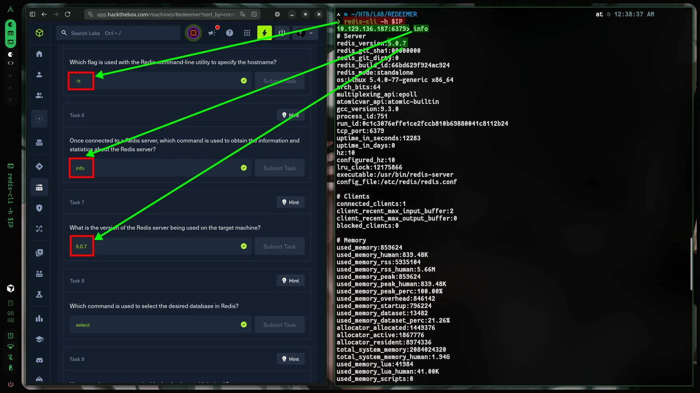
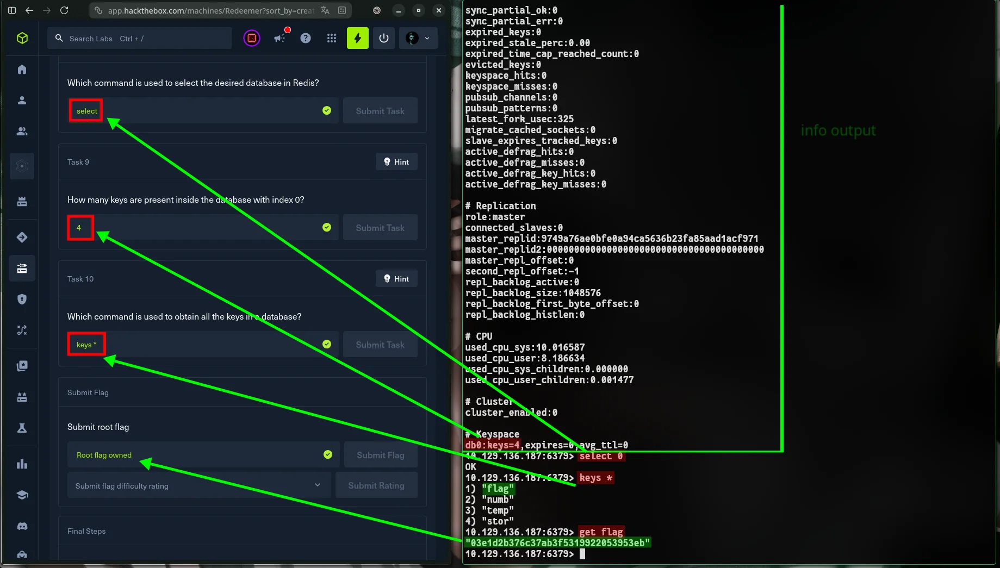

:::caution[Machine Information]
- **Platform:** HTB
- **Lab:** Starting Point
- **OS:** Linux
- **Difficulty:** Very Easy
- **IP:** `10.129.136.187`
:::

---

# Step 0: Getting Started

If you're not sure how to get started, [this will help -> Step 0: Getting Started.](https://www.cybalp.me/posts/CTF!/htb-meow/#step-0-getting-started)

```bash

mkdir -p HTB/LAB/REDEEMER && cd HTB/LAB/REDEEMER
IP=10.129.136.187 && ping -c 2 $IP

```

>  See also: [Here.](https://www.cybalp.me/posts/CTF!/htb-fawn/#step-0-getting-started)

Are you ready? OK!

---

# Step 1: Recon

```bash
nmap -Pn -sC -sV -p- $IP
```



**6379/tcp (Redis)** is open. In-memory database — try redis-cli for enumeration.

---

# Step 2: Solution

## Connect to Redis

```bash
redis-cli -h $IP
```



## Enumerate & Flag

```bash
info
select 0
keys *
get flag
exit
```

# Flag



```
03e1d2b376c37ab3f5319922053953eb
```

and PASTE!
