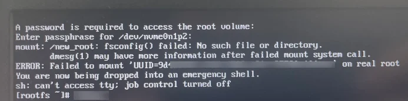
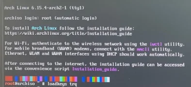
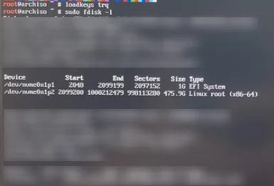
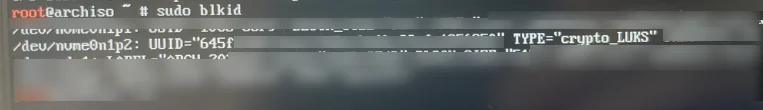
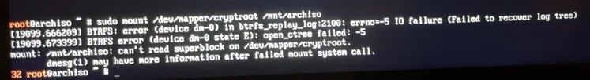
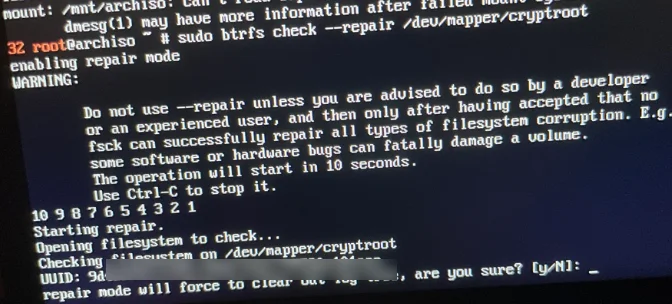
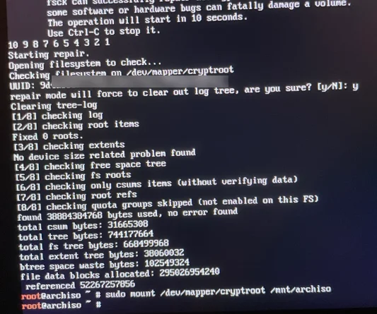
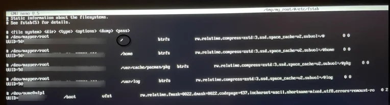

:::tip
1. Develop a hypothesis.
2. Access Arch Linux Live.
3. Open the encrypted disk.
4. Fix the UUID
5. Disconnect, restart.
:::

# Incident

I shutdown my computer when there were no visible problems. Hours later, when I turned it on, after entering the disk password, the system remained on the “emergency shell” screen. The critical error messages were:

`mount: ... fsconfig() failed` and `ERROR: Failed to mount ‘UUID=...’`. 

## Step 0: Hypothesis

Boot failed to enter **emergency shell**. UUID=9d... not found.



There is an incorrect UUID in `/etc/fstab`. And the system is looking for the wrong partition. But that wasn't the only problem.

## Step 1: Arch Linux Live Access



I accessed the **Arch Linux Live** environment for diagnosis and recovery.

> I am configuring my keyboard settings because I am using a Turkish keyboard.

### learning about the system



```bash

fdisk -l # examine the disk

```

- EFI -> `nvme0n1p1`
- Linux File System -> `nvme0n1p2`



```bash

blkid # UUID check

```

Correct UUID -> `645f...` . Ok.

## Step 2: Unlock the disk

```bash
sudo cryptsetup open /dev/nvme0n1p2 cryptroot
```

> `cryptroot` is the name of the opened mapping.

## Step 3: Fix the UUID | Critic Signal



```bash

sudo mkdir /mnt/archiso # I connect the root to the live system.
sudo mount /dev/mapper/cryptroot /mnt/archiso # Then I try to repair it.

```

We must understand these messages through the errors we receive:
- `log tree` cannot be recovered → BTRFS metadata is corrupted
- `errno=-5 I/O failure` → there is a read error
- `superblock` cannot be read → the file system cannot be mounted

Fixing the UUID will not resolve the issue. You must first fix the BTRFS corruption.

### Repair

I attempted repair while the disk was not connected to the live system:



```bash

sudo btrfs check --repair /dev/mapper/cryptroot

```
:::caution
The command issued a warning about the risk of data loss. All my data could have been lost. It wasn't a problem for me because my files are backed up; it might be for you.
:::

### try fix the UUID



and try mount

```bash
sudo mount /dev/mapper/cryptroot /mnt/archiso
```

We didn't get any errors. Great.



```bash
sudo nano /mnt/cryptroot/@/etc/fstab

```

Since BTRFS operates with a subvolume logic on the same disk, it is normal for lines such as `/home`, `/var/cache`, and `/var/log` in the file to use the same UUID.

The real issue was the `9d...` UUID in the root line. The UUID in this line was replaced with the correct UUID `645f...` found using `blkid`.

---

## Step 4: Disconnect and restart

```bash
sudo umount /dev/mapper/cryptroot # disconnect
reboot
```

And OK, Emergency Shell, you can come out now.

