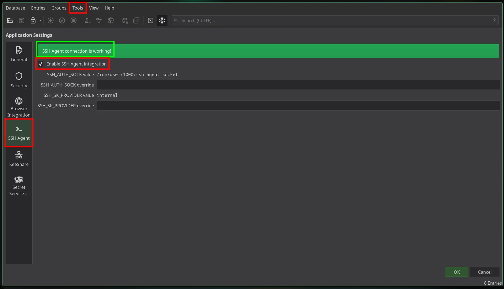
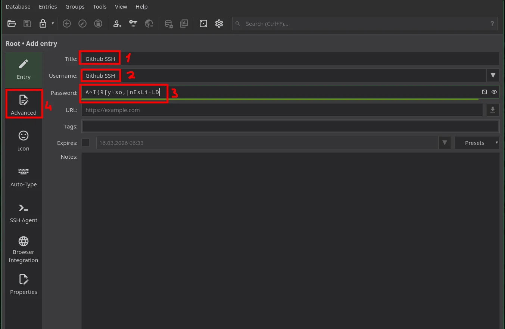
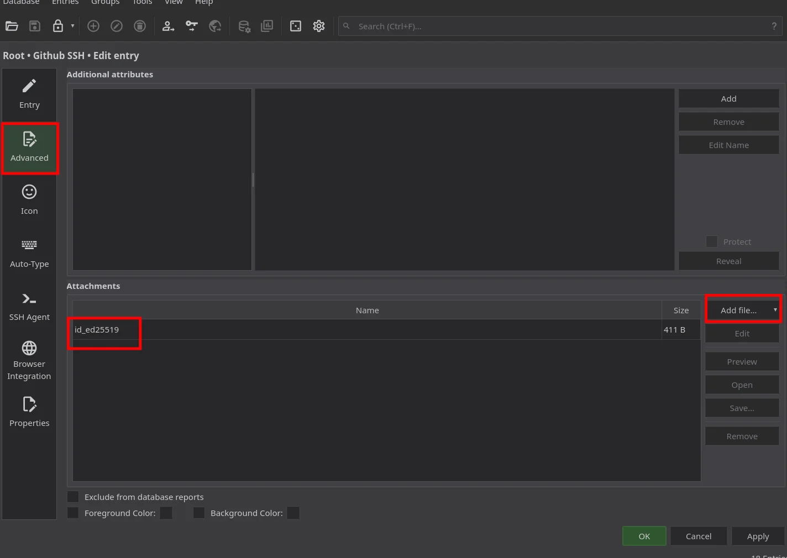
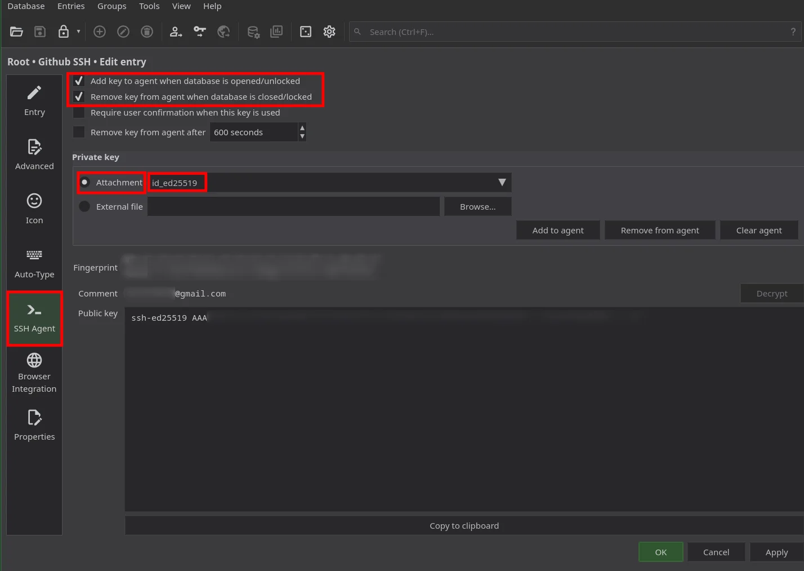
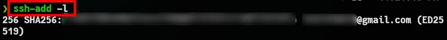

:::tip[Technique]
Store SSH private keys inside KeePassXC. Unlock the database → keys are injected into `ssh-agent`. Lock it → keys are removed. One unlock, all keys available. No `ssh-add`, no scattered key files.
:::

:::caution
This is not "create a database and add an entry." It's a **security architecture** decision: centralize key management, reduce attack surface, enforce unlock-on-use semantics.
:::

# Architecture

KeePassXC does **not** replace `ssh-agent`. It acts as a **client**: when the database is unlocked, it connects to the system's OpenSSH-compatible agent and adds keys. When locked or closed, it removes them. The keys never leave the database in plaintext except when the agent holds them in memory for authentication.

```
┌─────────────────┐     SSH Agent Protocol      ┌──────────────────┐
│   KeePassXC      │ ──────────────────────────► │  ssh-agent        │
│   (decrypted     │   add key / remove key      │  (system)         │
│    keys in RAM)  │ ◄────────────────────────── │  SSH_AUTH_SOCK    │
└─────────────────┘                              └──────────────────┘
         │                                                  │
         │ .kdbx (encrypted)                                │ ssh, git, rsync
         ▼                                                  ▼
   Database file                                    Remote servers
```

Keys are only exposed when the database is open. Close KeePassXC or lock it → keys vanish from the agent. No stale keys in memory after you walk away.

---

## Prerequisites

`ssh-agent` must be running and `SSH_AUTH_SOCK` must be set **before** KeePassXC starts. If you use a display manager or desktop environment, it often starts an agent (e.g. GNOME Keyring, `gpg-agent`). KeePassXC works with any OpenSSH-compatible agent.

```bash
echo $SSH_AUTH_SOCK   # Check if agent is available
```

If you see a path (e.g. `/run/user/1000/keyring/ssh` or `/tmp/ssh-xxxxx/agent.12345`), the agent is running. If empty:

```bash
eval "$(ssh-agent -s)"   # Start agent and export (add to ~/.bashrc or ~/.zshrc)
```

## Step 1: Enable SSH Agent in KeePassXC

1. **Tools → Settings → SSH Agent**
2. Check **Enable SSH Agent integration**
3. Optional: **Use custom socket path** if your agent uses a non-default socket
4. **OK**

---

## Step 2: SSH Enabled

Store the private key **inside** the database. No external file.



and -> SSH Agent connection is working!

---

## Step 3: Add SSH Key to an Entry

Add key.

Title: Enter what the key is for (e.g., GitHub - Alp or Prod Server).

Username: For the KeePassXC entry display. The identifier shown in `ssh-add -l` comes from the **SSH key's comment** (set when creating the key with `ssh-keygen -C`), not from this field.

Password: If you set a passphrase when creating the SSH key, enter it here. If the key is unpassphrased, you can leave this field blank.



OK! Advanced -> Then add the file that **does not have** a `.pub` extension!



and SSH Agent tab;



YEP! Now test.

---

## Step 4: Test

With KeePassXC **unlocked**, run:

```bash
ssh-add -l
```


Try again -> **Locked**

```bash
ssh-add -l
```


If the key is correctly loaded, authentication succeeds without `ssh-add` or manual key paths. Lock KeePassXC or close it → run `ssh-add -l` again → keys are gone. Unlock → they reappear.

---

# System, OK!
