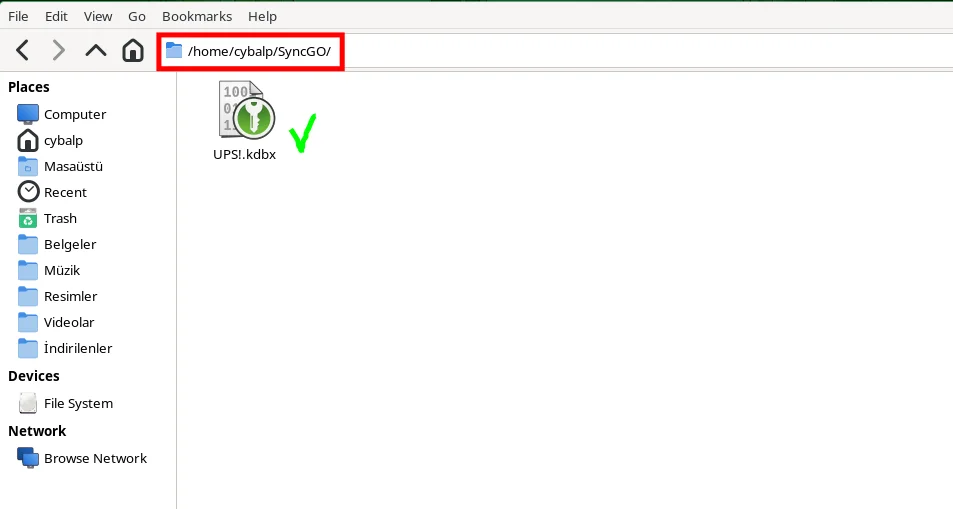
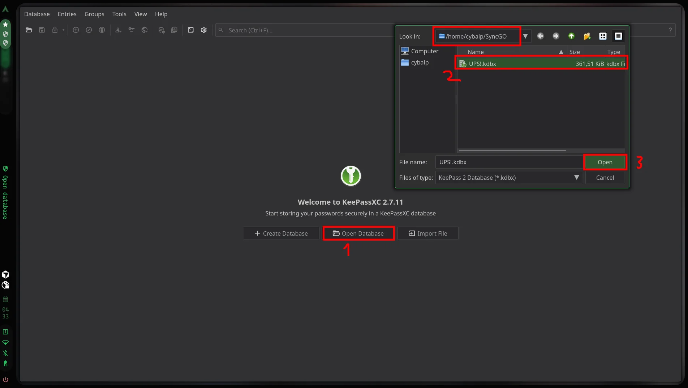
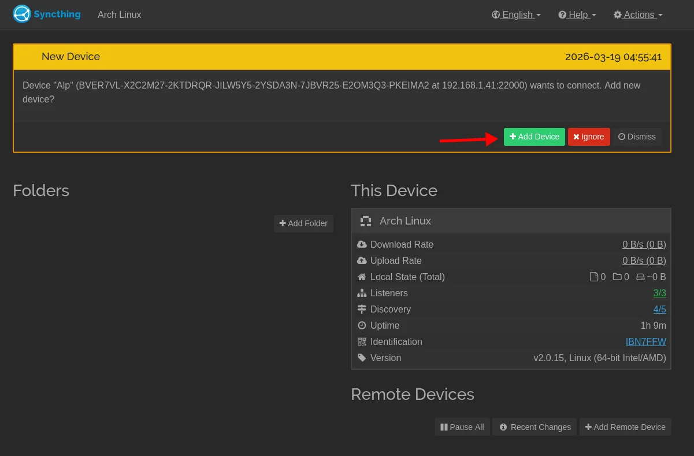
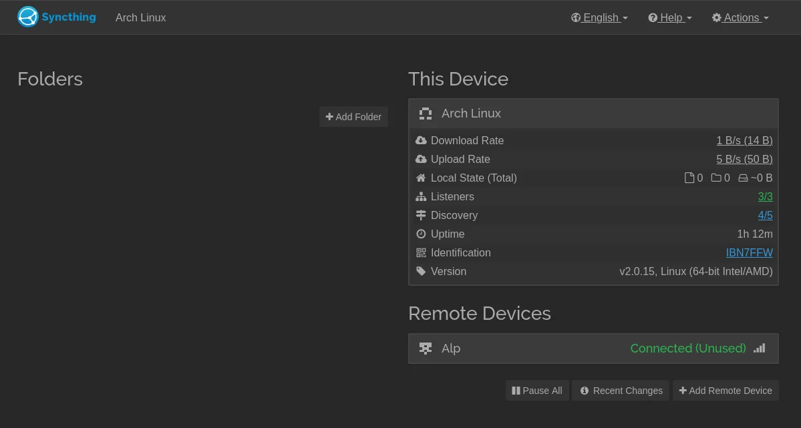
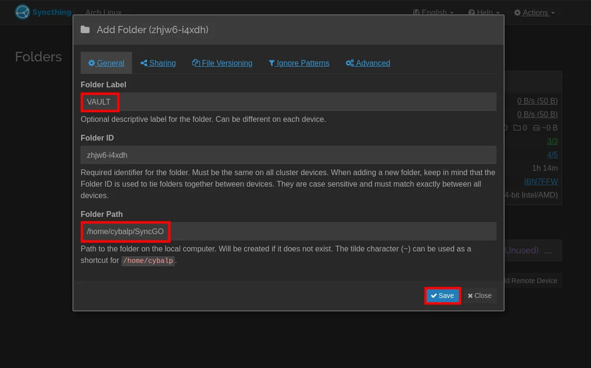
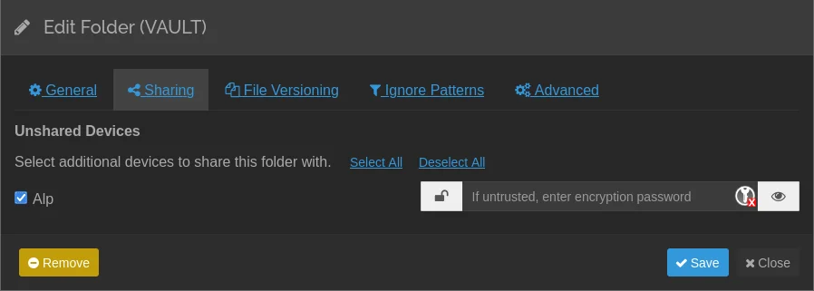

Hey! If you’ve decided to use KeePassXC in your daily life, you’ll run into a problem: syncing your phone with your computer. Every time you change a password, you’ll have to update it on both your computer and your phone. Ugh! That’s really a hassle…

So how can I automate this? Let’s see!

**[KeePassXC](../APP!/keepassxc.md) ⥄ [Syncthing](../APP!/syncthing.md)**

# Architecture

We have an iPhone. And, of course, our computer. We’ll be using these four apps for this automation:

- KeePassXC (computer)
- Syncthing (computer)
- Möbius Sync (iPhone)
- KeePassium (iPhone) 

It’s very simple. We’re going to change a username on our computer. This change will happen instantly on our iPhone as well. No cloud storage—everything is local. It’s quite secure.

> There may be differences in operating systems, devices, etc. Please adapt this application to your own system.

---

## Prerequisites

- You have **KeePassXC** installed on your computer and a database `.kdbx` that you use.
- **Syncthing** is installed and running on the computer.
- On your phone:
  - **iOS:** **Möbius Sync** (the iOS client for Syncthing).
  - **Android:** The official **Syncthing** app or a compatible client.
- **KeePassium** is installed on your phone (an app that opens KeePass `.kdbx` files).

---

## Step 1: Folder Select and KeePassXC Start

1. In Syncthing, select the **single folder** you want to sync. I named the folder ~/SyncGO. This folder will now serve as a shared folder on both your phone and computer.

Then I placed my database file with the `.kdbx` extension inside this folder.

2. By the way, from now on, you’ll need to open this file from this location every time you launch KeePassXC. Configure the settings.

## Step 2: Syncthing Configuration

1. Open the Syncthing Interface (usually `http://localhost:8384`) 

2. You need to select the device you want to connect to remotely. I’m assuming you’ve opened the Möbius Sync app on your iPhone. If your phone and computer are on the same Wi-Fi network, a notification will appear automatically.

and click **Add Folder** to add this folder.

Oh, right. Don’t forget to select the device from the Sharing tab..

## Step 3: Phone - Möbius Sync

- Just confirm the notification in the app—that’s all.

## Step 4: Phone - KeePassium

- All you need to do is add the `.kdbx` file from the folder created by Möbius Sync to the KeePassium application.

---

# Notes

Set it up once, and you’ll never have to deal with a password manager or syncing again. No more forgotten passwords, no cloud servers, no more forgotten usernames...

Don’t forget to set up the KeePassium app as your password manager on your iPhone.

If your iPhone doesn’t allow the Möbius app to run in the background, the Shortcuts app might offer a solution.

By the way, I’m just laying out the basics here. It’s up to you to build on this. If you have any questions, don’t hesitate to ask.

# Take care. OK!
