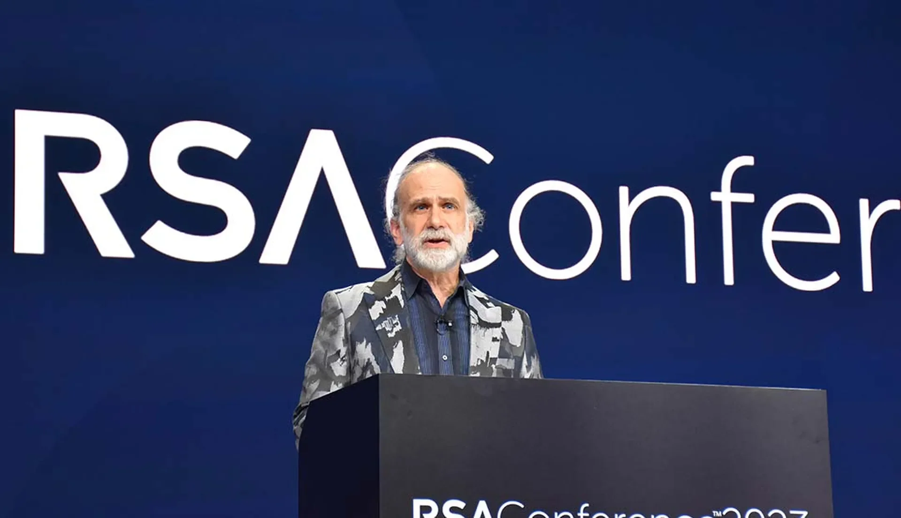
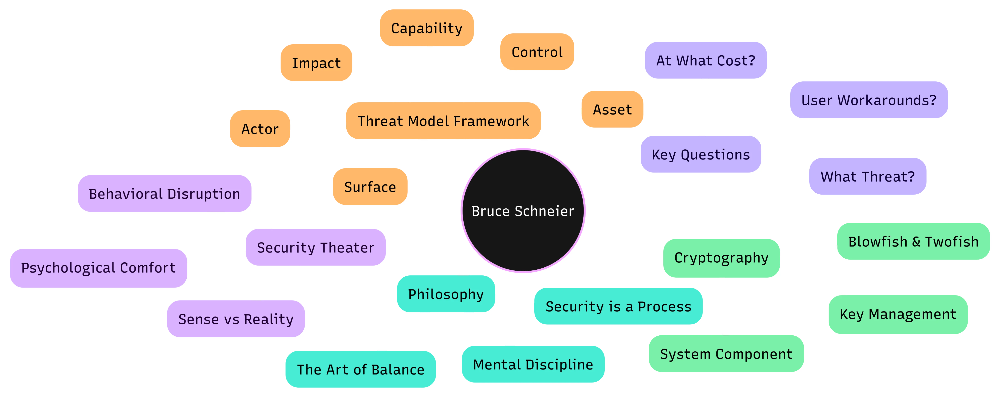

:::tip
“Security theater” Who are we performing for?
:::

:::caution
Let's put cryptography aside for a moment and talk about human behavior and risk perception.
:::

# MIND MAP

:::important
- Security ≠ Product! Process + People + Technology = Security
- “Who, what do they want, at what cost?” → Design
- Security Theater = Sense of Comfort → Real risk remains unchanged
- Trust = Social contract; technical decision → political outcome
:::

# Who is Bruce Schneier ?

According to Schneier, cybersecurity is not a technical race. It is a **mental discipline**. 
:spoiler[**Why are we protecting ourselves? Who are we protecting ourselves from? And at what cost?**] 

He believes that security is not just a matter for software developers or hackers. For Schneier, security is a whole that must be considered alongside :spoiler[**human psychology**], economics, politics, and social reflexes. That's why what he says affects not only technical teams, but also managers, decision-makers, and ordinary users.

| 

 |
| :---: |

## How do you define security?

Bruce Schneier removes security from being an “absolute” state. According to him, security is :spoiler[**risk management**].

So the question is not:
“Can this system be broken?”

The real question is:
:spoiler[“Is the risk of this system breaking down worth the benefits and costs it brings?”]

This perspective places the concept of risk analysis at the heart of security. There is no such thing as 100% security. But there is such a thing as **reasonable security**; this “reasonableness” is determined by the correct **threat model**.

A practical mini-framework for building a threat model:
- **Asset**: What are you protecting? (data? money? reputation? continuity?)
- **Actor**: Who attacks? (internal?, external?, competitor?, state?, opportunist?)
- **Capability**: How powerful? (time? money? access? skill?)
- **Surface**: Where do they enter? (email? API? device? human? supplier?)
- **Impact**: What do you lose? (money? downtime? legal consequences? loss of trust?)
- **Control**: Which measures reduce it by how much? (probability/impact/cost)

## Cryptography and Schneier's Contributions

Schneier's influence in the technical world stems from cryptography. Algorithms such as Blowfish and Twofish represent his contributions to the mathematical aspects of security. Twofish is also known as one of the leading designs in the AES selection process, which makes him not only someone who can “design algorithms” but also someone who can “think about design criteria.”

However, what truly sets Schneier apart from other cryptographers is this:

> “Cryptography can be strong, but if the system using it is **stupid**, the result is still insecure.”

Therefore, Schneier does not view cryptography as a savior on its own. He constantly emphasizes that issues such as key management, user error, misconfiguration, and process deficiencies can render cryptography meaningless.

In short: :spoiler[**Cryptography is a component; security is the entire system.**]

## Critique of Security Theater

One of Bruce Schneier's most well-known concepts is **security theater**. This concept describes measures that give people a sense of security but do not actually reduce risk.

Airport security is a classic example of this: removing shoes, liquid restrictions, symbolic checks... According to Schneier, some of these provide **psychological comfort** rather than preventing real threats.

Two more examples from everyday life:

- The requirement to **change passwords every 90 days**: If risk reduction is not measurable, it can disrupt user behavior (such as reusing the same password) and increase risk.

- **Completely disabling USB**: This can create backdoors (personal email, cloud) and make the risk invisible.

The difficult question we must ask here is:
:spoiler[Does this measure really reduce the likelihood/impact of an attack, or does it just make it visible?]

Bruce Schneier represents the “right question” side of cybersecurity, not the “more locks” side. He views security not as a race, but as an art of balance: a realistic balance between risk, cost, usability, and freedom.

In short... No to more locks, no need for theater. I need to ask the right questions. Risk, cost, usability, freedom. :spoiler[The art of balance.]

# REFLEX

Ask two important questions.

- What threat does this measure address, at what cost, and with what side effects?
- :spoiler[What workaround does it push the user toward?]

---

# MINIMUM INFO SET

**Key Message**
  - human, risk, and decision -> Security

**Remember**
  - A sense of security should not be confused with actual security.

