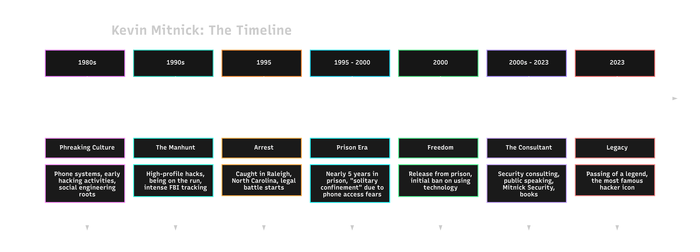
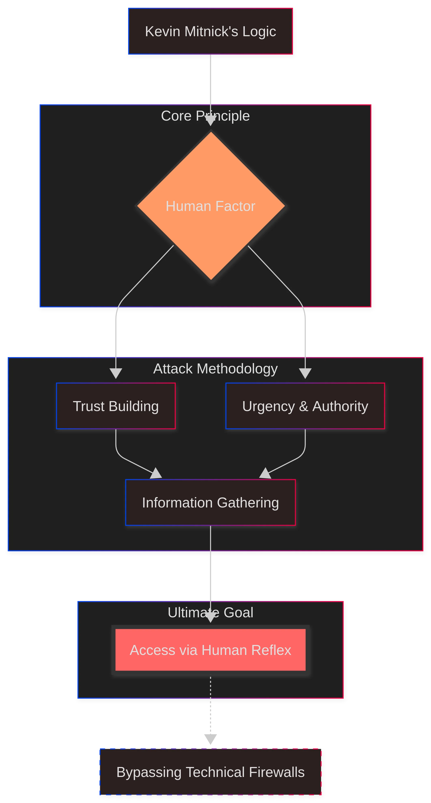

:::tip
He hacked people, not technology. He was a master of social engineering.
:::

# MIND MAP

:::important
- Technical Vulnerability -> :spoiler[Human]
- Persuasion + Role = Access
- Security -> Completed -> :spoiler[Behavioral Science]
- Procedure → Verification → :spoiler[Awareness]
- Simulation (drill) → See the blind spot
:::

# Who was Kevin Mitnick ?

Kevin was once known as a black hat hacker. He later became known as a security consultant. We're talking about him because he targeted people rather than technical patterns: the right tone and the right scenario and different manipulation techniques.

## Why was it talked about so much?

According to Kevin, security was not just a matter of software and hardware. Human behavior was variable. Companies could spend millions on expensive software. However, “if the right person was tricked in the right way, it could be bypassed.” Kevin clearly explained these techniques in his books The Art of Deception and The Art of Intrusion. 

| 

 |
| :---: |

The critical problem is this:

Think about it. You're at a trusted friend's house. You drank your coffee. You chatted a bit and left. You went to the bank... you went to the mall... you did some shopping... Hours later, you went home but couldn't find your keys. You called your friend, “Yep! I have your keys.”

A month later...

You went on a 3-day vacation. You came back from vacation and called the police because someone broke into your house.

Of course... Your friend might not be a bad person who would make a copy of your key. Might not be? You might have a key and lock your doors. But that doesn't mean “I'm safe.” What I mean is;

Our companies' systems may be password-protected. But if we have a careless employee, we are not safe.

“We use 20-character passwords in our systems!”

“Good. I hope you don't have an employee who writes these passwords down in a notebook in front of them.”

The Mitnick story is not about labels, but about recurring patterns. Today, even in the pentest/bug bounty world, if you can't find a technical vulnerability, you find a “process” vulnerability, and if there is no process vulnerability, you find a “human behavior” vulnerability. Today, if we don't know where a stranger works, we're not looking in the right places. LinkedIn? Don't use it? OK! Instagram? Facebook? You may not have written where you work in your bio. For a social engineer, a photo you shared with a coworker is enough. Or signs. Patterns... Patterns form chains.

For example, you are an employee at Company X. It's a busy day. You are still working. You wanted to share a story on Instagram.  The name of a software called Y appeared in the story you shared. The attacker saw this photo. They started researching the software. Or wait!! They didn't bother with it at all :)

They researched the company that owns the Y software. Then they contacted your company.

– Hello, I'm calling from such-and-such company. There's a critical update for the Y software. It appears to be installed on your end, but there's an incompatibility on the admin side.

– We did the update yesterday.

– Right, the main package has been updated. The problem usually occurs on systems still running **version 4.2** of Y. It seems you still have a node running that version.

– OK... that could be it. We had already upgraded Y from **4.1**.

– Okay, that's the info I was looking for. So the affected module is the Z plugin. We'll update that separately.

*Short pause.*

– :spoiler[**By the way, is Y running on Windows or on a Linux server for you?**]

– :spoiler[**Linux. Ubuntu 20.04.**]

– Got it, thanks. I've made a note of it and will pass it on to the team. We'll get back to you later today.

Now, instead of dealing with the Y software, we'll exploit vulnerabilities related to the Linux, Ubuntu 20.04.** version information. Something like that...

The classic pattern looks like this: 
1. Build trust, 
2. Create urgency, 
3. Establish authority, 
4. Get a small piece of information, 
5. Use that information to open a bigger door. 

Here: spoiler[“exploit”] is often not a CVE; it's the other side's reflex to help.

Mitnick's oft-repeated approach also feeds into this: The most powerful exploit is human error. This statement sounds cool, but its real meaning is disturbing: without human oversight (verification, second-guessing, recording) alongside technical controls, security becomes a joke.

Mitnick's lasting impact is that he exposed the “firewall” metaphor as insufficient on its own. There are people behind the wall, and people rush, help with good intentions, submit to authority, and *don't ask questions because they are embarrassed*. That's why technical controls must be complemented with human-process controls.

  <blockquote class="twitter-tweet" data-align="center" data-theme="dark">
    
As I said before.. There is no patch for stupidity

    &mdash; Kevin Mitnick (@kevinmitnick) 
    <a href="https://twitter.com/kevinmitnick/status/214814827305111554">June 18, 2012</a>
  </blockquote>

# REFLEX

Am I doing the stupid thing Kevin Mitnick mentioned?

---

# MINIMUM INFO SET

**Key Message**
  - Security is not just technology; it is human behavior and process design.

**Remember**
  - Persuasion is the fastest bypass method. That's why “habit” is as important as “rules”: call back, second confirmation, recording, minimum authorization, clear identity verification steps.

