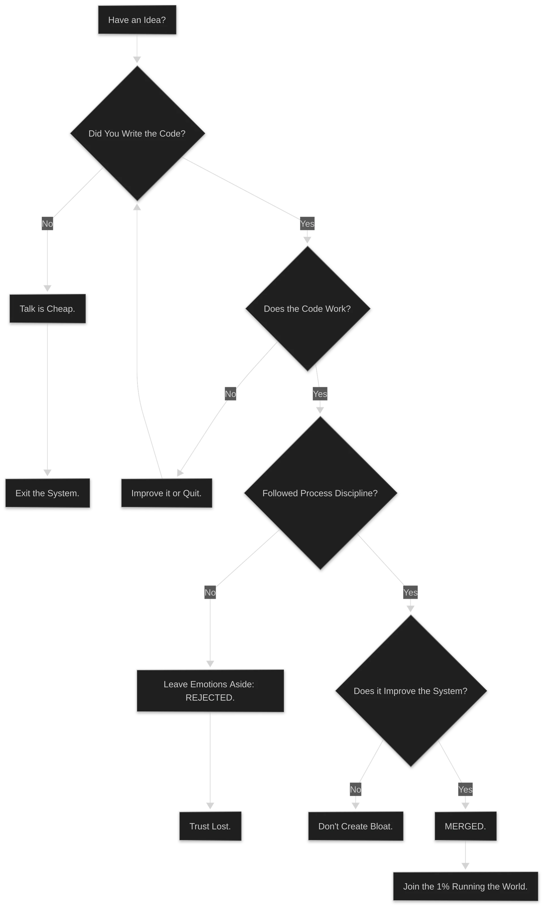

:::tip
"Talk is cheap. Show me the code."
:::

:::caution
He runs the Linux kernel — the backbone of the internet, Android, and most servers — with a discipline that makes corporate CTOs look like amateurs.
:::

# MIND MAP

:::important
- Code > Words → :spoiler[Meritocracy]
- Release discipline = Non-negotiable → Late patches = Rejected
- Maintainer trust = Earned, not given → :spoiler[No shortcuts]
- Bcachefs 2025 → 117k lines removed → Rules > Feelings
- Git = Distributed, fast, simple → Born from kernel pain
:::

# Who is Linus Torvalds ?

Linus Torvalds didn't just create Linux. He created a **culture**. A culture where your code speaks louder than your title, your reputation, or your excuses. A culture where :spoiler[**release cycles are sacred**] and "I'll fix it in the next RC" is not a valid answer.

In 2025, he proved it again. Bcachefs — a modern filesystem with ~117,000 lines of code — was **completely removed** from the Linux kernel. Not because the code was bad. Because the maintainer, Kent Overstreet, violated the rules: substantive changes during release candidates, emotional responses to feedback, and a breakdown of the trust that keeps the kernel stable. Torvalds didn't hesitate. Out. The message was clear: :spoiler[**The process protects billions of devices. Your feelings don't.**]

| 

 |
| :---: |

## Talk is cheap. Show me the code.

This phrase isn't just a slogan. It's the operating system of Linux development. No design documents that never get implemented. No meetings that could have been an email. No "we're looking into it." If you have an idea, you write the patch. If the patch is good, it gets merged. If it's not, you fix it or you don't. :spoiler[**No politics. No bureaucracy. Just code.**]

Torvalds has seen corporate development: months of planning, endless reviews, and tasks that should take a day stretching into quarters. He built the opposite. Linux moves fast because contributors **demonstrate** their work. The kernel doesn't run on promises. It runs on patches that compile, boot, and don't break existing systems.

## The Bcachefs lesson: Discipline over convenience

The Bcachefs removal wasn't personal. It was **structural**. The kernel has strict rules: during release candidates, only critical fixes. No new features. No "just this once." Overstreet pushed substantive changes for data-recovery purposes. Torvalds rejected them. The exchange escalated. Overstreet's response crossed a line. Torvalds's response was to remove the entire subsystem and mark it as externally maintained (DKMS). 

Why? Because the rules exist for a reason. The kernel runs on phones, servers, embedded devices, supercomputers. A single bad merge can cause data loss, security holes, or system-wide outages. :spoiler[**The release discipline exists to protect users, not to please maintainers.**] If one maintainer gets special treatment, the whole system collapses. Torvalds would rather lose a filesystem than lose the trust in the process.

## Git: Born from kernel pain

Before Git, Linux used BitKeeper. A proprietary tool. A single point of failure. When the relationship soured, Torvalds didn't hire a committee to "evaluate alternatives." He wrote Git in a weekend. A distributed version control system that was fast, simple, and didn't need a central server. Today, Git powers GitHub, GitLab, and virtually every software project on the planet. 

The lesson? :spoiler[**When the tool doesn't fit, build a better one.**] Don't wait for permission. Don't form a task force. Just solve the problem.

## The Torvalds paradox

He's been criticized for his tone. Harsh. Direct. Sometimes offensive. He's also been praised for taking a step back, reflecting, and apologizing when he crossed the line. The paradox is that his intensity and his willingness to admit mistakes come from the same place: **he cares about the code**. Not about being liked. Not about being diplomatic. About shipping something that works.

For Torvalds, the kernel is a shared responsibility. Thousands of maintainers, millions of lines, billions of users. The only way it works is through clear rules, consistent enforcement, and a culture where :spoiler[**merit is the only currency**]. Your patch either improves the system or it doesn't. Your argument either holds up or it doesn't. No amount of lobbying, seniority, or "we've always done it this way" changes that.

## Rules

- **Code is the contract.** If you can't show it, it doesn't exist.
- **Process exists to protect users.** Breaking it "just this once" is how systems fail.
- **Trust is earned.** Maintainers who violate the rules lose the privilege.
- **Build when you need to.** Don't wait for the perfect tool. Create it.
- **Meritocracy scales.** Linux proves that a strict, code-first culture can run the world's most critical software.

In short: Linus Torvalds is the anti-CEO. No quarterly reports. No stakeholder presentations. No "we're pivoting." Just :spoiler[**code, discipline, and a refusal to compromise on what matters**]. The kernel runs the world because he runs the kernel with the same rigor he demands from everyone else.

# REFLEX

Don’t make excuses—provide evidence. The moment you compromise on the process, you become part of chaos, not the system. If your code (or your work) requires you to break the rules, question your competence, not the rules. In Linus’s world, there’s no room for excuses; you either comply with the standards or you’re pushed out of the system.

---

# MINIMUM INFO SET

**Key Message**
  - *Code > Words* and *Process > Feelings* and *Merit > Politics.*

**Remember**
  - The rules exist to protect users. Breaking them "for a good reason" is how trust dies.

